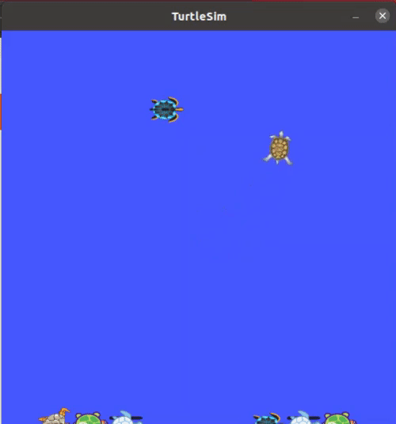
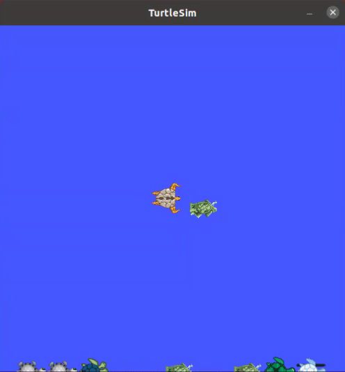
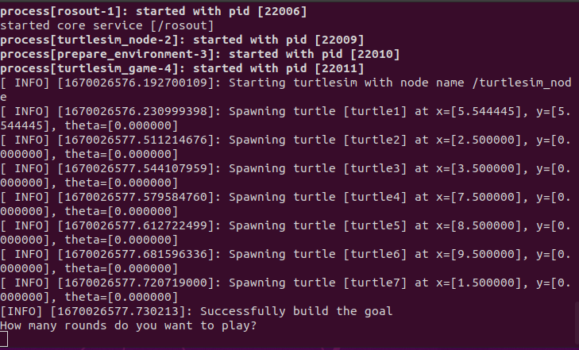
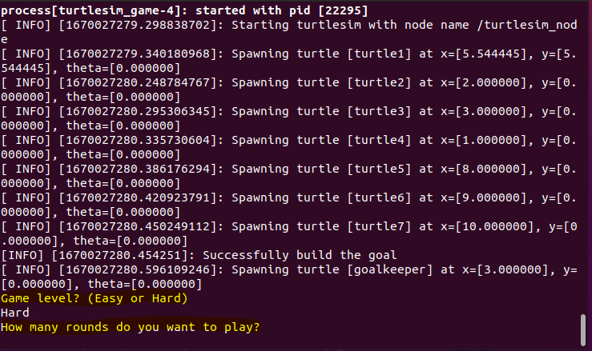

# Turtlesim Football

This repository hosts the source code for the ROS `Turtlesim_football` package, which is prepared for penalty kick football using the Robot Operating System (ROS 1 Noetic) and turtlesim package.

There are two options in this package:
- **Without goalkeeper**:



To learn more about the codes related to the "without goalkeeper" option, you can watch the video below:

[](https://youtu.be/w-5_SKlBvhw)

- **With goalkeeper**:



To learn more about the codes related to the "with goalkeeper" option, you can watch the video below:

[](https://youtu.be/se4f_wFxhCM)

## Usage
The `turtlesim` package is installed when you install the ROS. However, for any reason, if you do not have `turtlesim` package, you need to install it to run `turtlesim_football` package:

```console
$ sudo apt-get install ros-noetic-turtlesim
```

To use the `turtlesim_football` package, clone this repository into the `src` folder of your catkin workspace:

```console
$ git clone https://github.com/rezaeifh/turtlesim_football.git
```

Then compile the package in your workspace using `catkin_make` and then source your workspace:

```console
# compile the package:
$ catkin_make
# or use
$ catkin_make --pkg turtlesim_football

# source your workspace using the setup.bash or setup.zsh depending on your shell
$ source devel/setup.bash
$ source devel/setup.zsh
```
- **Without goalkeeper**:

To run the game `without goalkeeper`, start `roscore`, and run  `turtlesim_game_without_goalkeeper.launch`.

```console
$ roscore
$ roslaunch turtlesim_football turtlesim_game_without_goalkeeper.launch
```

Then, you need to enter the number of rounds you want to play:



Finally, you need to run the `turtlesim_teleop_key.py` to move the player (use w,a,d,and x keys):

```console
$ rosrun turtlesim_football turtlesim_teleop_key.py
```

- **With goalkeeper**:

To run the game `with goalkeeper`, start `roscore`, and run  `turtlesim_game_with_goalkeeper.launch`.

```console
$ roscore
$ roslaunch turtlesim_football turtlesim_game_with_goalkeeper.launch
```

Then, you need to enter the number of rounds and the level of the game (Hard or Easy):



Finally, you need to run the `turtlesim_teleop_key.py` to move the player (use w, a, d, and x keys):

```console
$ rosrun turtlesim_football turtlesim_teleop_key.py
```

Note that each of the three commands above should be executed from another terminal so that it will run in its own process.

**Enjoy the game!**


